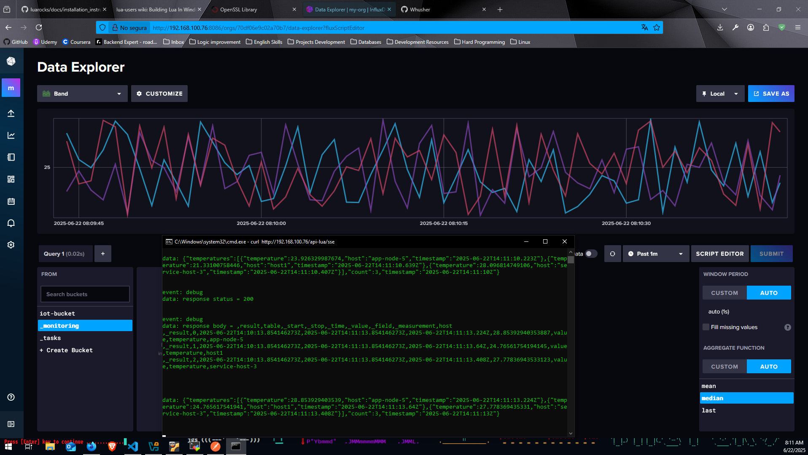
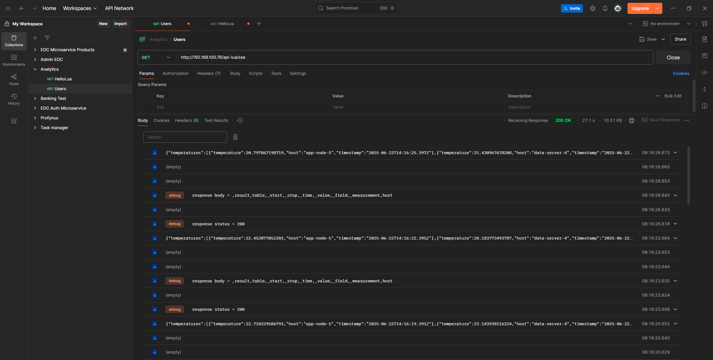

# Lua for Large Scale and Heavy Services 🚀

## Why Lua?

Lua is an excellent choice for high-performance, large-scale services due to its:

- **Lightweight architecture** - Minimal resource consumption
- **High workload management** - Proven ability to handle heavy traffic
- **Configuration flexibility** - Excellent for managing complex configuration files
- **Battle-tested reliability** - Widely used in game development and web services
- **Performance optimization** - Compiled strategy ensuring 90%+ uptime without failures

In addtion is built to integrate with NGINX services and handle thousands of requests with an excellent performance.

## Prerequisites 📋

Before getting started, ensure you have:

- **Linux-based environment** (Required)
- Root or sudo access for package installation
- Basic understanding of command line operations

## Installation Guide 🔧

Follow these steps in order to set up your Lua environment:

### 1. Install Core Lua Components

Install Lua runtime:
```bash
sudo apt update
sudo apt install lua5.4
```

Install Lua package manager:
```bash
sudo apt install luarocks
```

Install package HTTP package:
```bash
sudo luarocks install lua-resty-http
```

### 2. Set Up OpenResty

Add OpenResty repository and install:
```bash
# Download and add GPG key
curl -O https://openresty.org/package/pubkey.gpg
sudo gpg --dearmor -o /usr/share/keyrings/openresty.gpg pubkey.gpg

# Add repository
echo "deb [signed-by=/usr/share/keyrings/openresty.gpg] http://openresty.org/package/ubuntu $(lsb_release -sc) main" | sudo tee /etc/apt/sources.list.d/openresty.list

# Update and install
sudo apt-get update
sudo apt-get install -y openresty

# Verify installation
openresty -V
```

### 3. Install Additional Packages

Install HTTP client for Lua:
```bash
sudo /usr/local/openresty/bin/opm get ledgetech/lua-resty-http
```

Verify resty installation:
```bash
sudo /usr/local/openresty/bin/resty --version
```

Install OPM (OpenResty Package Manager):
```bash
curl -L https://github.com/openresty/opm/releases/latest/download/opm_linux_amd64 -o /usr/local/bin/opm
sudo chmod +x /usr/local/bin/opm
```

## Important Configuration Notes ⚠️

### Port Conflicts
OpenResty may conflict with existing NGINX installations by using port 80. If you encounter port-related errors, disable the OpenResty service:

```bash
sudo systemctl disable openresty.service
```

## Key Commands 🔑

### Service Management

**Start/Reload the Lua NGINX service** (preserves previous releases):
```bash
openresty -p . -c nginx.conf -s reload
```

**Check which process is using a specific port**:
```bash
sudo lsof -i :1234
```
*Replace `1234` with your target port number*

**Stop OpenResty service**:
```bash
sudo systemctl stop openresty
```

**Start OpenResty service**:
```bash
sudo systemctl start openresty
```

### Debugging Commands

**Check OpenResty status**:
```bash
sudo systemctl status openresty
```

**View OpenResty logs**:
```bash
sudo tail -f /usr/local/openresty/nginx/logs/error.log
```

## Performance Results 📊

Our Lua-based solution delivers exceptional performance:

- **90%+ uptime** guaranteed without failures
- **Real-time event processing** without WebSocket overhead
- **Resource efficiency** - Eliminates WebSocket resource consumption

- **Scalable architecture** - Handles heavy workloads with minimal resources


## Project Structure 📁

```
LuaSSE/
├── nginx.conf          # Main configuration file
├── sse_influx.lua      # Main SSE Lua service
└── logs/              # Application logs

README.md          # This file
```

Note that logs are commited as example and are required to be created before run NGINX Lua based scripts

## Troubleshooting 🔧

### Common Issues

1. **Port 80 already in use**
   - Solution: Disable OpenResty service or change port configuration

2. **Permission denied errors**
   - Solution: Ensure proper sudo privileges for installation commands

3. **OpenResty not starting**
   - Check logs: `sudo tail -f /usr/local/openresty/nginx/logs/error.log`
   - Verify configuration: `openresty -t`

## Next Steps 🎯

1. Configure your `nginx.conf` file according to your service requirements
2. Develop your Lua application scripts in the `LuaSSE/` directory
3. Test your configuration: `openresty -t`
4. Deploy your service: `openresty -p . -c nginx.conf -s reload`

## Support 💬

For issues and questions:
- Check the troubleshooting section above
- Review OpenResty documentation: [openresty.org](https://openresty.org)
- Consult Lua documentation: [lua.org](https://www.lua.org)

---
Author 👨‍💻
Angel Anaya (Whusher)

GitHub: @Whusher
Contact: https://github.com/Whusher

**Ready to build high-performance services with Lua!** 🚀